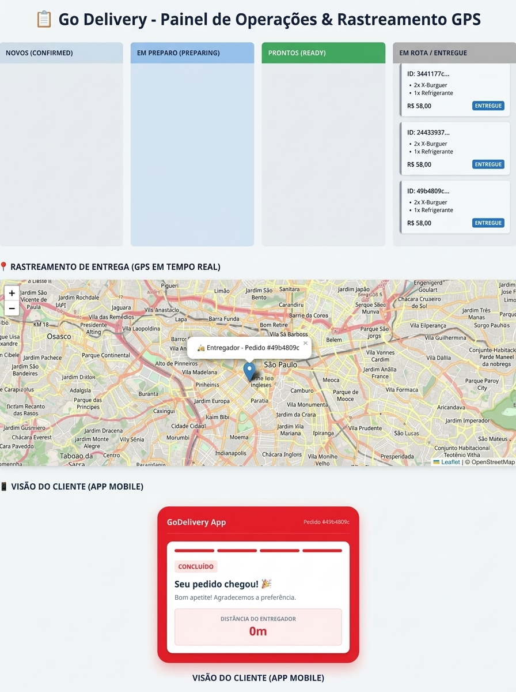

# 🛵 Go Delivery System - Processamento Concorrente de Pedidos & Rastreamento em Tempo Real

Plataforma de orquestração de entregas em tempo real construída com arquitetura de microserviços em Go . O sistema utiliza Redis para mensageria assíncrona/cache, PostgreSQL (PostGIS) para dados relacionais e geoespaciais, e WebSockets para streaming de dados em tempo real no Dashboard.

---

## 📸 Painel de Operações



---

## 🎯 Principais Funcionalidades & Engenharia

- Processamento Assíncrono via Redis: Fila de mensagens (`RPush` / `BLPop`) para desacoplar as requisições HTTP do processamento pesado.
- Worker Pool Concorrente em Go: Goroutines dedicadas consumindo a fila do Redis e executando transições de estado em paralelo.
- Streaming em Tempo Real (WebSockets / EventHub): Atualização instantânea dos cards no Kanban e movimentação dos marcadores no mapa Leaflet.js sem necessidade de polling.
- Rastreamento GPS & PostGIS: Simulação de rotas ponto a ponto do entregador persistindo coordenadas geográficas no banco espacial.
- Resiliência e Orquestração: Subida containerizada com _healthchecks_ encadeados via Docker Compose para eliminar race conditions.

---

## 🛠️ Tecnologias Utilizadas

- Linguagem: Go 1.20+
- Banco de Dados Relacional: PostgreSQL
- Fila & Cache: Redis (`go-redis/v9`)
- Comunicação em Tempo Real: WebSockets (`gorilla/websocket`)
- Frontend / Dashboard: HTML5, CSS3, JavaScript (Leaflet.js para mapas)

---

## Ciclo de Vida do Pedido (State Machine)

CONFIRMED: Pedido criado pelo cliente via API REST (/orders).
IN_PREPARATION: Cozinha assume o pedido via KDS (/orders/:id/status).
READY_FOR_DELIVERY: Cozinha finaliza o preparo.
OUT_FOR_DELIVERY: Motor de despacho aloca o entregador disponível (IDLE) no Redis e atualiza a rota.
DELIVERED: Entregador conclui a entrega no endereço do cliente.

## 🚀 Como Executar e Testar o Projeto

### Subir a Infraestrutura Containerizada (Inicie todos os microserviços, banco de dados e cache)

```bash
docker-compose up -d
```

## Escolha o Modo de Teste

🟢 Opção A: Simulação Visual no Navegador (Recomendado para UX/Interface)

1. Acesse o Painel de Operações em seu navegador: http://localhost:8080
2. Abra o DevTools (F12 $\rightarrow$ aba Console/Network) para acompanhar a conexão WebSocket ativa
3. Em outra janela do terminal, envie uma carga de pedidos concorrentes para ver os cards movimentando em tempo real: Dispara 20 pedidos simultâneos:

```bash
for i in {1..20}; do
   curl -s -X POST http://localhost:8080/orders \
     -H "Content-Type: application/json" \
     -d '{
       "store_id": "11111111-1111-1111-1111-111111111111",
       "delivery_latitude": -23.56168,
       "delivery_longitude": -46.655981,
       "items": [{"name": "X-Burguer", "quantity": 1, "price": 25.0}]
     }' > /dev/null &
done
```

🟡 Opção B: Simulação Automatizada E2E via CLI (Recomendado para Avaliação Técnica)

Se você deseja testar a resiliência das migrações, criação de schema, seed de dados e transição de estados dos microserviços de ponta a ponta sem necessidade de clicar na tela:

```Bash

make simulate-e2e

```

Reset -> Migrations -> Seed -> Disparo de pedido -> Alocação do Motoboy (Redis) ->

### 📁 Estrutura de Diretórios

.
├── cmd/
│ └── seed/ # Scripts para popular banco de dados e Redis
├── docs/
│ └── images/ # Ativos da documentação (screenshots e diagramas)
├── events/ # Hub WebSocket e barramento de eventos do domínio
├── workers/ # Worker Pool e consumidores da fila Redis
├── web/ # Interface Web, arquivos estáticos e mapa Leaflet.js
├── init.sql # Migrações SQL, tipos ENUM e tabelas PostGIS
├── docker-compose.yml# Orquestração de containers e healthchecks
├── Makefile # Scripts de automação de testes E2E e reset de banco
└── main.go # Ponto de entrada das APIs e servidores

## 📁 Estrutura do Projeto

```plaintext
.
├── cmd/
│   ├── seed/         # Population de dados mockados (lojas, entregadores e coordenadas)
│   ├── server/       # Ponto de entrada dos servidores e APIs em Go
│   └── simulation/   # Script de simulação de tráfego e requisições
├── docs/
│   └── images/       # Ativos de documentação e screenshots da aplicação
├── internal/         # Regras de negócio da aplicação (código privado Go)
│   ├── delivery/     # Serviços geoespaciais e workers de rastreamento de entregadores
│   ├── order/        # Handlers HTTP de pedidos e workers de processamento concorrente
│   └── platform/
│       └── events/   # Engine de WebSockets, Hub de clientes, DTOs e eventos de domínio
├── web/              # Interfaces estáticas do usuário (Dashboard, Painel da Loja e App Entregador)
├── docker-compose.yaml # Orquestração dos containers (PostgreSQL + PostGIS, Redis e APIs)
├── Dockerfile        # Build multi-stage da aplicação em Go
├── init.sql          # Migrações relacionais, extensão PostGIS, tipos ENUM e tabelas
└── Makefile          # Automação de resets de banco, build e testes E2E
```
